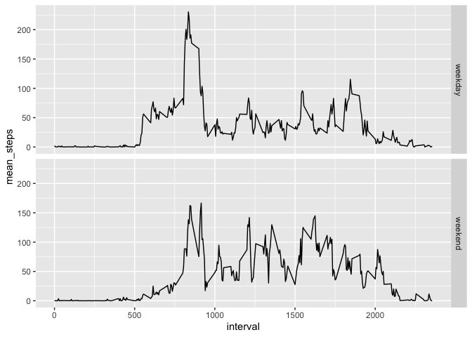

## Loading and preprocessing the data

```r
library(readr)
library(dplyr)
```

```
## 
## Attaching package: 'dplyr'
```

```
## The following objects are masked from 'package:stats':
## 
##     filter, lag
```

```
## The following objects are masked from 'package:base':
## 
##     intersect, setdiff, setequal, union
```

```r
library(ggplot2)

df <- read_csv("activity.zip")
```

```
## Parsed with column specification:
## cols(
##   steps = col_double(),
##   date = col_date(format = ""),
##   interval = col_double()
## )
```
## What is mean total number of steps taken per day?

###Calculate the total number of steps taken per day

```r
total_step_day <- df %>%
dplyr::group_by(date) %>%
dplyr::summarize(total_steps = sum(steps, na.rm = TRUE))

head(total_step_day)
```

```
## # A tibble: 6 x 2
##   date       total_steps
##   <date>           <dbl>
## 1 2012-10-01           0
## 2 2012-10-02         126
## 3 2012-10-03       11352
## 4 2012-10-04       12116
## 5 2012-10-05       13294
## 6 2012-10-06       15420
```
###Histogram of number of steps each day

```r
hist(total_step_day$total_steps)
```

<!-- -->
### Mean and median of total number of steps per dat

```r
mean_step_day <- mean(total_step_day$total_steps)
print(paste0("Mean steps: ",mean_step_day))
```

```
## [1] "Mean steps: 9354.22950819672"
```

```r
median_step_day <- median(total_step_day$total_steps)
print(paste0("Median steps: ",median_step_day))
```

```
## [1] "Median steps: 10395"
```

## What is the average daily activity pattern?
### interval pattern

```r
interval_pattern <- df %>%
    dplyr::group_by(interval) %>%
    dplyr::summarize(mean_steps = mean(steps, na.rm = TRUE))

plot(y =interval_pattern$mean_steps, x = interval_pattern$interval, type = "l")
```

<!-- -->

### What 5 minutes interval contain the max number of steps

```r
head(interval_pattern %>% 
dplyr::arrange(desc(mean_steps)) %>%
.$interval,1)
```

```
## [1] 835
```

## Imputing missing values
### Number of missing values

```r
print(paste0("Missing values: ",nrow(df %>% dplyr::filter(is.na(steps)))))
```

```
## [1] "Missing values: 2304"
```

### Impute missing values

```r
df2 <- df %>% 
    dplyr::mutate(steps = ifelse(is.na(steps), 
        interval_pattern %>% dplyr::filter(interval == interval) %>% .$mean_steps,
        steps))
```

###Calculate the total number of steps taken per day

```r
total_step_day2 <- df2 %>%
dplyr::group_by(date) %>%
dplyr::summarize(total_steps = sum(steps, na.rm = TRUE))

head(total_step_day2)
```

```
## # A tibble: 6 x 2
##   date       total_steps
##   <date>           <dbl>
## 1 2012-10-01      10766.
## 2 2012-10-02        126 
## 3 2012-10-03      11352 
## 4 2012-10-04      12116 
## 5 2012-10-05      13294 
## 6 2012-10-06      15420
```

###Histogram of number of steps each day

```r
hist(total_step_day2$total_steps)
```

<!-- -->
## Are there differences in activity patterns between weekdays and weekends?

```r
df2 <- df2 %>%
    dplyr::mutate(day = weekdays(date),
    week_day = factor(ifelse(day  %in% c("Saturday","Sunday"), "weekend", "weekday")))
    
interval_pattern2 <- df2 %>%
    dplyr::group_by(interval, week_day) %>%
    dplyr::summarize(mean_steps = mean(steps, na.rm = TRUE))

p <- ggplot(interval_pattern2, aes(x=interval, y = mean_steps)) +
geom_line() +
facet_grid(week_day ~ .)

print(p)
```

<!-- -->

